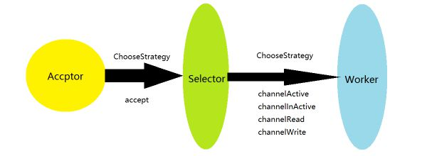

# MiniNetty

## 实现的功能

- channelActive/channelInActive/channelRead/channelWrite事件处理

- HandlerInitializer 

- Handler链式处理

- StringEncoder/StringDecoder

- LengthFieldBasedDecoder

- DelimiterBasedDecoder

- LineBasedDecoder

## 线程模型

